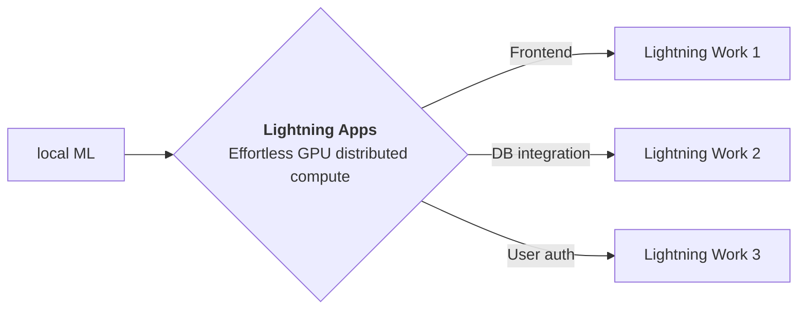

<div style="height: 90pt;"></div>
<div style="flex: 0 0 16%; margin-top: -10pt;">

</div>
<div style="flex: 0 0 65%; text-align: center;">
<h1 style="margin-bottom: 10pt;">Demo: Thin-Plate Spline Motion Model for Image Animation</h1>
<h2>A Research Poster demo using Lightning App</h2>
</div>
<div style="flex: 1">
    <div style="display: flex; align-items: center;">
        
        <div style="font-size: 0.9rem; margin-right: 5pt;"><a href="https://github.com/openai/">OpenAI</a></div>
    </div>
    <div style="display: flex; align-items: center;">
        
        <div style="font-size: 0.9rem;"><a href="https://twitter.com/OpenAI">@OpenAI</a></div>
    </div>
</div>

--split--

# Thin-Plate Spline Motion Model for Image Animation

## Image animation transfers the motion of the object in the driving video to the static object in the source image

Our (Author's) method can animate a variety of objects, including
talking faces, human bodies, and pixel animations. Experiments demonstrate that our method performs better on most
benchmarks than the state of the art with visible improvements in motion-related metrics

This app is a demo
of [Lightning Research Template app](https://github.com/Lightning-AI/lightning-template-research-app) which allows
authors to build an app to share their everything
related to their work at a single place.
Explore the tabs at the top of this app to view blog, paper, training logs and model demo.

You can fork this app and edit to customize according to your need.


--split--

# Lightning Apps

## Lightning Apps can be built for any AI use case, including AI research, fault-tolerant production-ready pipelines, and everything in between.

!!! abstract "Key Features"

    - **Easy to use-** Lightning apps follow the Lightning philosophy- easy to read, modular, intuitive, pythonic and highly composable interface that allows you to focus on what's important for you, and automate the rest.
    - **Easy to scale**- Lightning provides a common experience locally and in the cloud. The Lightning.ai cloud platform abstracts the infrastructure, so you can run your apps at any scale. The modular and composable framework allows for simpler testing and debugging.
    - **Leverage the power of the community-** Lightning.ai offers a variety of apps for any use case you can use as is or build upon. By following the best MLOps practices provided through the apps and documentation you can deploy state-of-the-art ML applications in days, not months.



### Available at : `Lightning-AI/lightning-template-research-app/app.py`

```python
import lightning as L

poster_dir = "resources"
paper = "https://arxiv.org/pdf/2203.14367.pdf"
tabs = ["Blog", "Paper", "Poster", "Notebook Viewer", "Training Logs", "Model Demo"]

app = L.LightningApp(
    ResearchApp(
        poster_dir=poster_dir,
        paper=paper,
        notebook_path="resources/demo.ipynb",
        launch_gradio=True,
        tab_order=tabs,
        launch_jupyter_lab=False,  # don't launch for public app, can expose to security vulnerability
    ),
    debug=True,
)

```

### Citation

```bibtex

@article{YourName,
  title={Your Title},
  author={Your team},
  journal={Location},
  year={Year}
}

```
